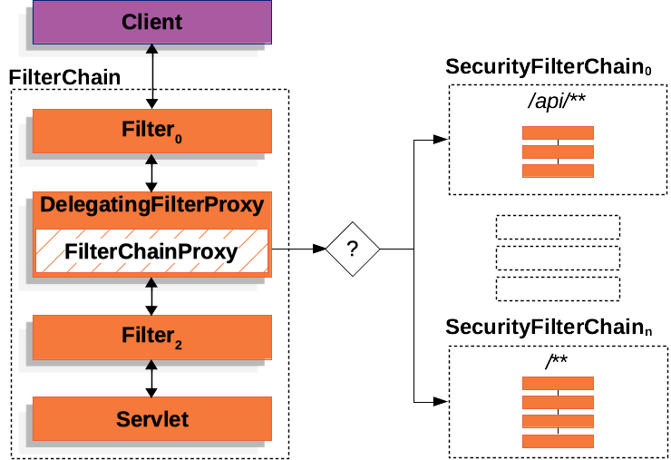
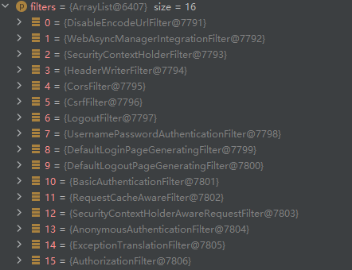
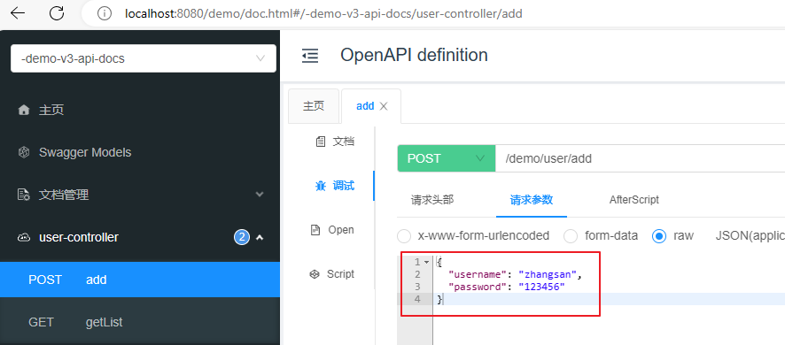
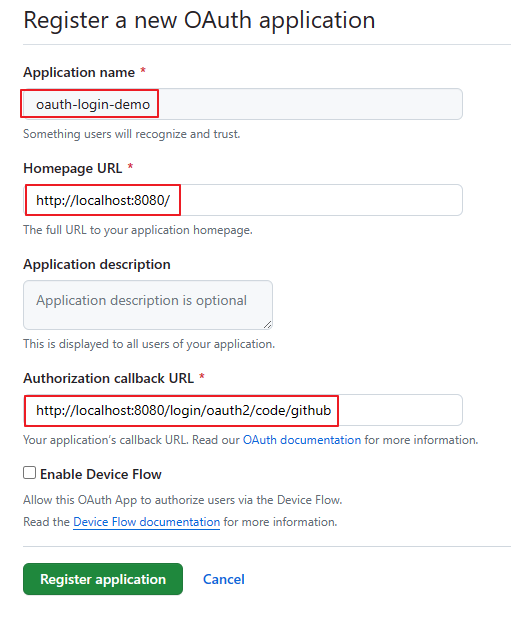

# 第一章 Spring Security快速入门

**官方文档：**

https://docs.spring.io/spring-security/reference/index.html


**功能：**

- 身份认证（authentication）
- 授权（authorization）
- 防御常见攻击（protection against common attacks）


**身份认证：**

- 身份认证是验证`谁正在访问系统资源`，判断用户是否为合法用户。认证用户的常见方式是要求用户输入用户名和密码。


**授权：**

- 用户进行身份认证后，系统会控制`谁能访问哪些资源`，这个过程叫做授权。用户无法访问没有权限的资源。


**防御常见攻击：**

- CSRF
- HTTP Headers
- HTTP Requests


## 1、身份认证（authentication）

**官方代码示例：**[GitHub - spring-projects/spring-security-samples](https://github.com/spring-projects/spring-security-samples/tree/main)

### 1.1、创建Spring Boot项目

项目名：security-demo

JDK：17

SpringBoot：3.2.0（依赖了Spring Security 6.2.0）

Dependencies：Spring Web、Spring Security、Thymeleaf


### 1.2、创建IndexController

```java
package com.atguigu.securitydemo.controller;

@Controller
public class IndexController {

    @GetMapping("/")
    public String index() {
        return "index";
    }
}
```


### 1.3、创建index.html

在路径resources/templates中创建index.html

```html
<html xmlns:th="https://www.thymeleaf.org">
<head>
  <title>Hello Security!</title>
</head>
<body>
<h1>Hello Security</h1>
<!--通过使用@{/logout}，Thymeleaf将自动处理生成正确的URL，以适应当前的上下文路径。
这样，无论应用程序部署在哪个上下文路径下，生成的URL都能正确地指向注销功能。-->
<a th:href="@{/logout}">Log Out</a>
</body>
</html>
```


### 1.4、启动项目测试Controller

浏览器中访问：http://localhost:8080/

**浏览器自动跳转到登录页面：**http://localhost:8080/login


输入用户名：user

输入密码：在控制台的启动日志中查找初始的默认密码

点击"Sign in"进行登录，浏览器就跳转到了index页面


### 1.5、注意事项

#### 1.5.1、@{/logout}的作用

通过使用@{/logout}，Thymeleaf将自动处理生成正确的URL，以适应当前的上下文路径。这样，无论应用程序部署在哪个上下文路径下，生成的URL都能正确地指向注销功能。

例如：如果我们在配置文件中添加如下内容

```yaml
server.servlet.context-path=/demo
```

那么@{/logout}可以自动处理url为正确的相对路径

但是如果是普通的/logout，路径就会不正确


#### 1.5.2、页面样式无法加载的问题

页面样式bootstrap.min.css是一个CDN地址，需要通过科学上网的方式访问


否则你的登录页会加载很久，并且看到的页面是这样的（登录按钮没有样式文件渲染，但是不影响登录功能的执行）


### 1.6、Spring Security默认做了什么

- 保护应用程序URL，要求对应用程序的任何交互进行身份验证。
- 程序启动时生成一个默认用户“user”。
- 生成一个默认的随机密码，并将此密码记录在控制台上。
- 生成默认的登录表单和注销页面。
- 提供基于表单的登录和注销流程。
- 对于Web请求，重定向到登录页面；
- 对于服务请求，返回401未经授权。
- 处理跨站请求伪造（CSRF）攻击。
- 处理会话劫持攻击。
- 写入Strict-Transport-Security以确保HTTPS。
- 写入X-Content-Type-Options以处理嗅探攻击。
- 写入Cache Control头来保护经过身份验证的资源。
- 写入X-Frame-Options以处理点击劫持攻击。


## 2、Spring Security 的底层原理

**官方文档：**[Spring Security的底层原理](https://docs.spring.io/spring-security/reference/servlet/architecture.html)

Spring Security之所以默认帮助我们做了那么多事情，它的底层原理是传统的`Servlet过滤器`


### 2.1、Filter

下图展示了处理一个Http请求时，过滤器和Servlet的工作流程：


因此我们可以在过滤器中对请求进行修改或增强。


### 2.2、DelegatingFilterProxy

DelegatingFilterProxy 是 Spring Security 提供的一个 Filter 实现，可以在 Servlet 容器和 Spring 容器之间建立桥梁。通过使用 DelegatingFilterProxy，这样就可以将Servlet容器中的 Filter 实例放在 Spring 容器中管理。


### 2.3、FilterChainProxy

复杂的业务中不可能只有一个过滤器。因此FilterChainProxy是Spring Security提供的一个特殊的Filter，它允许通过SecurityFilterChain将过滤器的工作委托给多个Bean Filter实例。


### 2.4、SecurityFilterChain

SecurityFilterChain 被 FilterChainProxy 使用，负责查找当前的请求需要执行的Security Filter列表。


### 2.5、Multiple SecurityFilterChain

可以有多个SecurityFilterChain的配置，FilterChainProxy决定使用哪个SecurityFilterChain。如果请求的URL是/api/messages/，它首先匹配SecurityFilterChain0的模式/api/\*\*，因此只调用SecurityFilterChain 0。假设没有其他SecurityFilterChain实例匹配，那么将调用SecurityFilterChain n。




## 3、程序的启动和运行

### 3.1、DefaultSecurityFilterChain

SecurityFilterChain接口的实现，加载了默认的16个Filter




### 3.2、SecurityProperties

默认情况下Spring Security将初始的用户名和密码存在了SecurityProperties类中。这个类中有一个静态内部类User，配置了默认的用户名（name = "user"）和密码（password = uuid）


我们也可以将用户名、密码配置在SpringBoot的配置文件中：在application.properties中配置自定义用户名和密码

```properties
spring.security.user.name=user
spring.security.user.password=123
```


# 第二章 Spring Security自定义配置

## 1、基于内存的用户认证

### 1.1、创建自定义配置

实际开发的过程中，我们需要应用程序更加灵活，可以在SpringSecurity中创建自定义配置文件

**官方文档：**[Java自定义配置](https://docs.spring.io/spring-security/reference/servlet/configuration/java.html)

**UserDetailsService**用来管理用户信息，**InMemoryUserDetailsManager**是UserDetailsService的一个实现，用来管理基于内存的用户信息。


创建一个WebSecurityConfig文件：

定义一个@Bean，类型是UserDetailsService，实现是InMemoryUserDetailsManager

```java
package com.atguigu.securitydemo.config;

@Configuration
@EnableWebSecurity//Spring项目总需要添加此注解，SpringBoot项目中不需要
public class WebSecurityConfig {

    @Bean
    public UserDetailsService userDetailsService() {
        InMemoryUserDetailsManager manager = new InMemoryUserDetailsManager();
        manager.createUser( //此行设置断点可以查看创建的user对象
            User
            .withDefaultPasswordEncoder()
            .username("huan") //自定义用户名
            .password("password") //自定义密码
            .roles("USER") //自定义角色
            .build()
        );
        return manager;
    }
}
```


**测试：**使用用户名huan，密码password登录


### 1.2、基于内存的用户认证流程

- 程序启动时：
  - 创建`InMemoryUserDetailsManager`对象
  - 创建`User`对象，封装用户名密码
  - 使用InMemoryUserDetailsManager`将User存入内存`
- 校验用户时：
  - SpringSecurity自动使用`InMemoryUserDetailsManager`的`loadUserByUsername`方法从`内存中`获取User对象
  - 在`UsernamePasswordAuthenticationFilter`过滤器中的`attemptAuthentication`方法中将用户输入的用户名密码和从内存中获取到的用户信息进行比较，进行用户认证


## 2、基于数据库的数据源

### 2.1、SQL

创建三个数据库表并插入测试数据

```sql
-- 创建数据库
CREATE DATABASE `security-demo`;
USE `security-demo`;

-- 创建用户表
CREATE TABLE `user`(
	`id` INT NOT NULL AUTO_INCREMENT PRIMARY KEY,
	`username` VARCHAR(50) DEFAULT NULL ,
	`password` VARCHAR(500) DEFAULT NULL,
	`enabled` BOOLEAN NOT NULL
);
-- 唯一索引
CREATE UNIQUE INDEX `user_username_uindex` ON `user`(`username`); 

-- 插入用户数据(密码是 "abc" )
INSERT INTO `user` (`username`, `password`, `enabled`) VALUES
('admin', '{bcrypt}$2a$10$GRLdNijSQMUvl/au9ofL.eDwmoohzzS7.rmNSJZ.0FxO/BTk76klW', TRUE),
('Helen', '{bcrypt}$2a$10$GRLdNijSQMUvl/au9ofL.eDwmoohzzS7.rmNSJZ.0FxO/BTk76klW', TRUE),
('Tom', '{bcrypt}$2a$10$GRLdNijSQMUvl/au9ofL.eDwmoohzzS7.rmNSJZ.0FxO/BTk76klW', TRUE);
```


### 2.2、引入依赖

```xml
<dependency>
    <groupId>mysql</groupId>
    <artifactId>mysql-connector-java</artifactId>
    <version>8.0.30</version>
</dependency>

<dependency>
    <groupId>com.baomidou</groupId>
    <artifactId>mybatis-plus-boot-starter</artifactId>
    <version>3.5.4.1</version>
    <exclusions>
        <exclusion>
            <groupId>org.mybatis</groupId>
            <artifactId>mybatis-spring</artifactId>
        </exclusion>
    </exclusions>
</dependency>

<dependency>
    <groupId>org.mybatis</groupId>
    <artifactId>mybatis-spring</artifactId>
    <version>3.0.3</version>
</dependency>

<dependency>
    <groupId>org.projectlombok</groupId>
    <artifactId>lombok</artifactId>
</dependency>
```


### 2.3、配置数据源

```properties
#MySQL数据源
spring.datasource.driver-class-name=com.mysql.cj.jdbc.Driver
spring.datasource.url=jdbc:mysql://localhost:3306/security-demo
spring.datasource.username=root
spring.datasource.password=123456
#SQL日志
mybatis-plus.configuration.log-impl=org.apache.ibatis.logging.stdout.StdOutImpl
```


### 2.4、实体类

```java
package com.atguigu.securitydemo.entity;

@Data
public class User {

    @TableId(value = "id", type = IdType.AUTO)
    private Integer id;

    private String username;

    private String password;

    private Boolean enabled;

}
```


### 2.5、Mapper

接口

```java
package com.atguigu.securitydemo.mapper;

@Mapper
public interface UserMapper extends BaseMapper<User> {
}
```


xml

resources/mapper/UserMapper.xml

```xml
<?xml version="1.0" encoding="UTF-8"?>
<!DOCTYPE mapper PUBLIC "-//mybatis.org//DTD Mapper 3.0//EN" "http://mybatis.org/dtd/mybatis-3-mapper.dtd">
<mapper namespace="com.atguigu.securitydemo.mapper.UserMapper">

</mapper>
```


### 2.6、Service

接口

```java
package com.atguigu.securitydemo.service;

public interface UserService extends IService<User> {
}
```

实现

```java
package com.atguigu.securitydemo.service.impl;

@Service
public class UserServiceImpl extends ServiceImpl<UserMapper, User> implements UserService {
}
```


### 2.7、Controller

```java
package com.atguigu.securitydemo.controller;

@RestController
@RequestMapping("/user")
public class UserController {

    @Resource
    public UserService userService;

    @GetMapping("/list")
    public List<User> getList(){
        return userService.list();
    }
}
```


**测试：**[localhost:8080/demo/user/list](http://localhost:8080/demo/user/list)


## 3、基于数据库的用户认证

### 3.1、基于数据库的用户认证流程

- 程序启动时：
  - 创建`DBUserDetailsManager`类，实现接口 UserDetailsManager, UserDetailsPasswordService
  - 在应用程序中初始化这个类的对象
- 校验用户时：
  - SpringSecurity自动使用`DBUserDetailsManager`的`loadUserByUsername`方法从`数据库中`获取User对象
  - 在`UsernamePasswordAuthenticationFilter`过滤器中的`attemptAuthentication`方法中将用户输入的用户名密码和从数据库中获取到的用户信息进行比较，进行用户认证


### 3.2、定义DBUserDetailsManager

```java
package com.atguigu.securitydemo.config;

public class DBUserDetailsManager implements UserDetailsManager, UserDetailsPasswordService {
    
    @Resource
    private UserMapper userMapper;

    @Override
    public UserDetails loadUserByUsername(String username) throws UsernameNotFoundException {

        QueryWrapper<User> queryWrapper = new QueryWrapper<>();
        queryWrapper.eq("username", username);
        User user = userMapper.selectOne(queryWrapper);
        if (user == null) {
            throw new UsernameNotFoundException(username);
        } else {
            Collection<GrantedAuthority> authorities = new ArrayList<>();
            return new org.springframework.security.core.userdetails.User(
                    user.getUsername(),
                    user.getPassword(),
                    user.getEnabled(),
                    true, //用户账号是否过期
                    true, //用户凭证是否过期
                    true, //用户是否未被锁定
                    authorities); //权限列表
        }
    }

    @Override
    public UserDetails updatePassword(UserDetails user, String newPassword) {
        return null;
    }

    @Override
    public void createUser(UserDetails user) {

    }

    @Override
    public void updateUser(UserDetails user) {

    }

    @Override
    public void deleteUser(String username) {

    }

    @Override
    public void changePassword(String oldPassword, String newPassword) {

    }

    @Override
    public boolean userExists(String username) {
        return false;
    }
}

```


### 3.3、初始化UserDetailsService

修改WebSecurityConfig中的userDetailsService方法如下

```java
@Bean
public UserDetailsService userDetailsService() {
    DBUserDetailsManager manager = new DBUserDetailsManager();
    return manager;
}
```

**或者直接在DBUserDetailsManager类上添加@Component注解**


**测试：**使用数据库中配置的用户名和密码进行登录


## 4、SpringSecurity的默认配置

在WebSecurityConfig中添加如下配置

```java
@Bean
public SecurityFilterChain filterChain(HttpSecurity http) throws Exception {
    //authorizeRequests()：开启授权保护
    //anyRequest()：对所有请求开启授权保护
    //authenticated()：已认证请求会自动被授权
    http
        .authorizeRequests(authorize -> authorize.anyRequest().authenticated())
        .formLogin(withDefaults())//表单授权方式
        .httpBasic(withDefaults());//基本授权方式

    return http.build();
}
```


## 5、添加用户功能

### 5.1、Controller

UserController中添加方法

```java
@PostMapping("/add")
public void add(@RequestBody User user){
    userService.saveUserDetails(user);
}
```


### 5.2、Service

UserService接口中添加方法

```java
void saveUserDetails(User user);
```

UserServiceImpl实现中添加方法

```java
@Resource
private DBUserDetailsManager dbUserDetailsManager;

@Override
public void saveUserDetails(User user) {

    UserDetails userDetails = org.springframework.security.core.userdetails.User
            .withDefaultPasswordEncoder()
            .username(user.getUsername()) //自定义用户名
            .password(user.getPassword()) //自定义密码
            .build();
    dbUserDetailsManager.createUser(userDetails);

}
```


### 5.3、修改配置

DBUserDetailsManager中添加方法

```java
@Override
public void createUser(UserDetails userDetails) {

    User user = new User();
    user.setUsername(userDetails.getUsername());
    user.setPassword(userDetails.getPassword());
    user.setEnabled(true);
    userMapper.insert(user);
}
```


### 5.4、使用Swagger测试

pom中添加配置用于测试

```xml
<!--swagger测试-->
<dependency>
    <groupId>com.github.xiaoymin</groupId>
    <artifactId>knife4j-openapi3-jakarta-spring-boot-starter</artifactId>
    <version>4.1.0</version>
</dependency>
```


**Swagger测试地址：**http://localhost:8080/demo/doc.html




### 5.5、关闭csrf攻击防御

默认情况下SpringSecurity开启了csrf攻击防御的功能，这要求请求参数中必须有一个隐藏的**_csrf**字段，如下：


在filterChain方法中添加如下代码，关闭csrf攻击防御

```java
//关闭csrf攻击防御
http.csrf((csrf) -> {
    csrf.disable();
});
```


## 6、密码加密算法

**参考文档：**[Password Storage :: Spring Security](https://docs.spring.io/spring-security/reference/features/authentication/password-storage.html)


### 6.1、密码加密方式

**明文密码：**

最初，密码以明文形式存储在数据库中。但是恶意用户可能会通过SQL注入等手段获取到明文密码，或者程序员将数据库数据泄露的情况也可能发生。


**Hash算法：**

Spring Security的`PasswordEncoder`接口用于对密码进行`单向转换`，从而将密码安全地存储。对密码单向转换需要用到`哈希算法`，例如MD5、SHA-256、SHA-512等，哈希算法是单向的，`只能加密，不能解密`。

因此，`数据库中存储的是单向转换后的密码`，Spring Security在进行用户身份验证时需要将用户输入的密码进行单向转换，然后与数据库的密码进行比较。

因此，如果发生数据泄露，只有密码的单向哈希会被暴露。由于哈希是单向的，并且在给定哈希的情况下只能通过`暴力破解的方式猜测密码`。


**彩虹表：**

恶意用户创建称为`彩虹表`的查找表。

```
彩虹表就是一个庞大的、针对各种可能的字母组合预先生成的哈希值集合，有了它可以快速破解各类密码。越是复杂的密码，需要的彩虹表就越大，主流的彩虹表都是100G以上，目前主要的算法有LM, NTLM, MD5, SHA1, MYSQLSHA1, HALFLMCHALL, NTLMCHALL, ORACLE-SYSTEM, MD5-HALF。
```


**加盐密码：**

为了减轻彩虹表的效果，开发人员开始使用加盐密码。不再只使用密码作为哈希函数的输入，而是为每个用户的密码生成随机字节（称为盐）。盐和用户的密码将一起经过哈希函数运算，生成一个唯一的哈希。盐将以明文形式与用户的密码一起存储。然后，当用户尝试进行身份验证时，盐和用户输入的密码一起经过哈希函数运算，再与存储的密码进行比较。唯一的盐意味着彩虹表不再有效，因为对于每个盐和密码的组合，哈希都是不同的。


**自适应单向函数：**

随着硬件的不断发展，加盐哈希也不再安全。原因是，计算机可以每秒执行数十亿次哈希计算。这意味着我们可以轻松地破解每个密码。

现在，开发人员开始使用自适应单向函数来存储密码。使用自适应单向函数验证密码时，`故意占用资源（故意使用大量的CPU、内存或其他资源）`。自适应单向函数允许配置一个`“工作因子”`，随着硬件的改进而增加。我们建议将“工作因子”调整到系统中验证密码需要约一秒钟的时间。这种权衡是为了`让攻击者难以破解密码`。

自适应单向函数包括`bcrypt、PBKDF2、scrypt和argon2`。


### 6.2、PasswordEncoder

**BCryptPasswordEncoder**

使用广泛支持的bcrypt算法来对密码进行哈希。为了增加对密码破解的抵抗力，bcrypt故意设计得较慢。和其他自适应单向函数一样，应该调整其参数，使其在您的系统上验证一个密码大约需要1秒的时间。BCryptPasswordEncoder的默认实现使用强度10。建议您在自己的系统上调整和测试强度参数，以便验证密码时大约需要1秒的时间。


**Argon2PasswordEncoder**

使用Argon2算法对密码进行哈希处理。Argon2是密码哈希比赛的获胜者。为了防止在自定义硬件上进行密码破解，Argon2是一种故意缓慢的算法，需要大量内存。与其他自适应单向函数一样，它应该在您的系统上调整为大约1秒来验证一个密码。当前的Argon2PasswordEncoder实现需要使用BouncyCastle库。


**Pbkdf2PasswordEncoder**

使用PBKDF2算法对密码进行哈希处理。为了防止密码破解，PBKDF2是一种故意缓慢的算法。与其他自适应单向函数一样，它应该在您的系统上调整为大约1秒来验证一个密码。当需要FIPS认证时，这种算法是一个很好的选择。


**SCryptPasswordEncoder** 

使用scrypt算法对密码进行哈希处理。为了防止在自定义硬件上进行密码破解，scrypt是一种故意缓慢的算法，需要大量内存。与其他自适应单向函数一样，它应该在您的系统上调整为大约1秒来验证一个密码。


### 6.3、密码加密测试

在测试类中编写一个测试方法

```java
@Test
void testPassword() {

    // 工作因子，默认值是10，最小值是4，最大值是31，值越大运算速度越慢
    PasswordEncoder encoder = new BCryptPasswordEncoder(4);
    //明文："password"
    //密文：result，即使明文密码相同，每次生成的密文也不一致
    String result = encoder.encode("password");
    System.out.println(result);

    //密码校验
    Assert.isTrue(encoder.matches("password", result), "密码不一致");
}
```


### 6.4、DelegatingPasswordEncoder

- 表中存储的密码形式：`{bcrypt}`$2a$10$GRLdNijSQMUvl/au9ofL.eDwmoohzzS7.rmNSJZ.0FxO/BTk76klW
- 通过如下源码可以知道：可以通过`{bcrypt}`前缀动态获取和密码的形式类型一致的PasswordEncoder对象
- 目的：方便随时做密码策略的升级，兼容数据库中的老版本密码策略生成的密码


## 7、自定义登录页面

### 7.1、创建登录Controller

```java
package com.atguigu.securitydemo.controller;

@Controller
public class LoginController {

    @GetMapping("/login")
    public String login() {
        return "login";
    }
}
```


### 7.2、创建登录页面

resources/templates/login.html

```html
<!DOCTYPE html>
<html xmlns:th="https://www.thymeleaf.org">
<head>
    <title>登录</title>
</head>
<body>
<h1>登录</h1>
<div th:if="${param.error}">
    错误的用户名和密码.</div>

<!--method必须为"post"-->
<!--th:action="@{/login}" ，
使用动态参数，表单中会自动生成_csrf隐藏字段，用于防止csrf攻击
login: 和登录页面保持一致即可，SpringSecurity自动进行登录认证-->
<form th:action="@{/login}" method="post">
    <div>
        <!--name必须为"username"-->
        <input type="text" name="username" placeholder="用户名"/>
    </div>
    <div>
        <!--name必须为"password"-->
        <input type="password" name="password" placeholder="密码"/>
    </div>
    <input type="submit" value="登录" />
</form>
</body>
</html>
```


### 7.3、配置SecurityFilterChain

SecurityConfiguration：

```java
.formLogin( form -> {
    form
        .loginPage("/login").permitAll() //登录页面无需授权即可访问
        .usernameParameter("username") //自定义表单用户名参数，默认是username
        .passwordParameter("password") //自定义表单密码参数，默认是password
        .failureUrl("/login?error") //登录失败的返回地址
        ;
}); //使用表单授权方式
```


# 第三章 前后端分离

## 1、用户认证流程

- 登录成功后调用：AuthenticationSuccessHandler
- 登录失败后调用：AuthenticationFailureHandler


## 2、引入fastjson

```xml
<dependency>
    <groupId>com.alibaba.fastjson2</groupId>
    <artifactId>fastjson2</artifactId>
    <version>2.0.37</version>
</dependency>
```


## 3、认证成功的响应

### 3.1、成功结果处理

```java
package com.atguigu.securitydemo.config;

public class MyAuthenticationSuccessHandler implements AuthenticationSuccessHandler {
    @Override
    public void onAuthenticationSuccess(HttpServletRequest request, HttpServletResponse response, Authentication authentication) throws IOException, ServletException {

        //获取用户身份信息
        Object principal = authentication.getPrincipal();

        //创建结果对象
        HashMap result = new HashMap();
        result.put("code", 0);
        result.put("message", "登录成功");
        result.put("data", principal);

        //转换成json字符串
        String json = JSON.toJSONString(result);

        //返回响应
        response.setContentType("application/json;charset=UTF-8");
        response.getWriter().println(json);
    }
}
```

### 3.2、SecurityFilterChain配置

```java
form.successHandler(new MyAuthenticationSuccessHandler()) //认证成功时的处理
```


## 4、认证失败响应

### 4.1、失败结果处理

```java
package com.atguigu.securitydemo.config;

public class MyAuthenticationFailureHandler implements AuthenticationFailureHandler {

    @Override
    public void onAuthenticationFailure(HttpServletRequest request, HttpServletResponse response, AuthenticationException exception) throws IOException, ServletException {

        //获取错误信息
        String localizedMessage = exception.getLocalizedMessage();

        //创建结果对象
        HashMap result = new HashMap();
        result.put("code", -1);
        result.put("message", localizedMessage);

        //转换成json字符串
        String json = JSON.toJSONString(result);

        //返回响应
        response.setContentType("application/json;charset=UTF-8");
        response.getWriter().println(json);
    }
}
```

### 4.2SecurityFilterChain配置

```java
form.failureHandler(new MyAuthenticationFailureHandler()) //认证失败时的处理
```


## 5、注销响应

### 5.1、注销结果处理

```java
package com.atguigu.securitydemo.config;

public class MyLogoutSuccessHandler implements LogoutSuccessHandler {

    @Override
    public void onLogoutSuccess(HttpServletRequest request, HttpServletResponse response, Authentication authentication) throws IOException, ServletException {

        //创建结果对象
        HashMap result = new HashMap();
        result.put("code", 0);
        result.put("message", "注销成功");

        //转换成json字符串
        String json = JSON.toJSONString(result);

        //返回响应
        response.setContentType("application/json;charset=UTF-8");
        response.getWriter().println(json);
    }
}
```


### 5.2、SecurityFilterChain配置

```java
http.logout(logout -> {
    logout.logoutSuccessHandler(new MyLogoutSuccessHandler()); //注销成功时的处理
});
```


## 6、请求未认证的接口

### 6.1、实现AuthenticationEntryPoint接口

[Servlet Authentication Architecture :: Spring Security](https://docs.spring.io/spring-security/reference/servlet/authentication/architecture.html)

当访问一个需要认证之后才能访问的接口的时候，Spring Security会使用`AuthenticationEntryPoint`将用户请求跳转到登录页面，要求用户提供登录凭证。

这里我们也希望系统`返回json结果`，因此我们定义类`实现AuthenticationEntryPoint接口`

```java
package com.atguigu.securitydemo.config;

public class MyAuthenticationEntryPoint implements AuthenticationEntryPoint {
    @Override
    public void commence(HttpServletRequest request, HttpServletResponse response, AuthenticationException authException) throws IOException, ServletException {

        //获取错误信息
        //String localizedMessage = authException.getLocalizedMessage();

        //创建结果对象
        HashMap result = new HashMap();
        result.put("code", -1);
        result.put("message", "需要登录");

        //转换成json字符串
        String json = JSON.toJSONString(result);

        //返回响应
        response.setContentType("application/json;charset=UTF-8");
        response.getWriter().println(json);
    }
}
```


### 6.2、SecurityFilterChain配置

```java
//错误处理
http.exceptionHandling(exception  -> {
    exception.authenticationEntryPoint(new MyAuthenticationEntryPoint());//请求未认证的接口
});
```


## 7、跨域

跨域全称是跨域资源共享(Cross-Origin Resources Sharing,CORS)，它是浏览器的保护机制，只允许网页请求统一域名下的服务，同一域名指=>协议、域名、端口号都要保持一致，如果有一项不同，那么就是跨域请求。在前后端分离的项目中，需要解决跨域的问题。


在SpringSecurity中解决跨域很简单，在配置文件中添加如下配置即可

```java
//跨域
http.cors(withDefaults());
```


# 第四章 身份认证

## 1、用户认证信息

### 1.1、基本概念


在Spring Security框架中，SecurityContextHolder、SecurityContext、Authentication、Principal和Credential是一些与身份验证和授权相关的重要概念。它们之间的关系如下：


1. SecurityContextHolder：SecurityContextHolder 是 Spring Security 存储已认证用户详细信息的地方。
2. SecurityContext：SecurityContext 是从 SecurityContextHolder 获取的内容，包含当前已认证用户的 Authentication 信息。
3. Authentication：Authentication 表示用户的身份认证信息。它包含了用户的Principal、Credential和Authority信息。
4. Principal：表示用户的身份标识。它通常是一个表示用户的实体对象，例如用户名。Principal可以通过Authentication对象的getPrincipal()方法获取。
5. Credentials：表示用户的凭证信息，例如密码、证书或其他认证凭据。Credential可以通过Authentication对象的getCredentials()方法获取。
6. GrantedAuthority：表示用户被授予的权限

总结起来，SecurityContextHolder用于管理当前线程的安全上下文，存储已认证用户的详细信息，其中包含了SecurityContext对象，该对象包含了Authentication对象，后者表示用户的身份验证信息，包括Principal（用户的身份标识）和Credential（用户的凭证信息）。


### 1.2、在Controller中获取用户信息

IndexController：

```java
package com.atguigu.securitydemo.controller;

@RestController
public class IndexController {

    @GetMapping("/")
    public Map index(){

        System.out.println("index controller");

        SecurityContext context = SecurityContextHolder.getContext();//存储认证对象的上下文
        Authentication authentication = context.getAuthentication();//认证对象
        String username = authentication.getName();//用户名
        Object principal =authentication.getPrincipal();//身份
        Object credentials = authentication.getCredentials();//凭证(脱敏)
        Collection<? extends GrantedAuthority> authorities = authentication.getAuthorities();//权限

        System.out.println(username);
        System.out.println(principal);
        System.out.println(credentials);
        System.out.println(authorities);

        //创建结果对象
        HashMap result = new HashMap();
        result.put("code", 0);
        result.put("data", username);

        return result;
    }
}
```


## 2、会话并发处理

后登录的账号会使先登录的账号失效

### 2.1、实现处理器接口

实现接口SessionInformationExpiredStrategy

```java
package com.atguigu.securitydemo.config;

public class MySessionInformationExpiredStrategy implements SessionInformationExpiredStrategy {
    @Override
    public void onExpiredSessionDetected(SessionInformationExpiredEvent event) throws IOException, ServletException {

        //创建结果对象
        HashMap result = new HashMap();
        result.put("code", -1);
        result.put("message", "该账号已从其他设备登录");

        //转换成json字符串
        String json = JSON.toJSONString(result);

        HttpServletResponse response = event.getResponse();
        //返回响应
        response.setContentType("application/json;charset=UTF-8");
        response.getWriter().println(json);
    }
}
```


### 2.2、SecurityFilterChain配置

```java
//会话管理
http.sessionManagement(session -> {
    session
        .maximumSessions(1)
        .expiredSessionStrategy(new MySessionInformationExpiredStrategy());
});
```


# 第五章 授权

授权管理的实现在SpringSecurity中非常灵活，可以帮助应用程序实现以下两种常见的授权需求：

- 用户-权限-资源：例如张三的权限是添加用户、查看用户列表，李四的权限是查看用户列表

- 用户-角色-权限-资源：例如 张三是角色是管理员、李四的角色是普通用户，管理员能做所有操作，普通用户只能查看信息

  

## 1、基于request的授权

### 1.1、用户-权限-资源

**需求：**

- 具有USER_LIST权限的用户可以访问/user/list接口
- 具有USER_ADD权限的用户可以访问/user/add接口

#### 配置权限

SecurityFilterChain

```java
//开启授权保护
http.authorizeRequests(
        authorize -> authorize
    			//具有USER_LIST权限的用户可以访问/user/list
                .requestMatchers("/user/list").hasAuthority("USER_LIST")
    			//具有USER_ADD权限的用户可以访问/user/add
    			.requestMatchers("/user/add").hasAuthority("USER_ADD")
                //对所有请求开启授权保护
                .anyRequest()
                //已认证的请求会被自动授权
                .authenticated()
        );
```

#### 授予权限

DBUserDetailsManager中的loadUserByUsername方法：

```java
Collection<GrantedAuthority> authorities = new ArrayList<>();
authorities.add(()->"USER_LIST");
authorities.add(()->"USER_ADD");

/*authorities.add(new GrantedAuthority() {
    @Override
    public String getAuthority() {
        return "USER_LIST";
    }
});
authorities.add(new GrantedAuthority() {
    @Override
    public String getAuthority() {
        return "USER_ADD";
    }
});*/
```

#### 请求未授权的接口

SecurityFilterChain

```java
//错误处理
http.exceptionHandling(exception  -> {
    exception.authenticationEntryPoint(new MyAuthenticationEntryPoint());//请求未认证的接口
    exception.accessDeniedHandler((request, response, e)->{ //请求未授权的接口

        //创建结果对象
        HashMap result = new HashMap();
        result.put("code", -1);
        result.put("message", "没有权限");

        //转换成json字符串
        String json = JSON.toJSONString(result);

        //返回响应
        response.setContentType("application/json;charset=UTF-8");
        response.getWriter().println(json);
    });
});
```


**更多的例子：**[Authorize HttpServletRequests :: Spring Security](https://docs.spring.io/spring-security/reference/servlet/authorization/authorize-http-requests.html)


### 1.2、用户-角色-资源

**需求：**角色为ADMIN的用户才可以访问/user/**路径下的资源

#### 配置角色

SecurityFilterChain

```java
//开启授权保护
http.authorizeRequests(
        authorize -> authorize
                //具有管理员角色的用户可以访问/user/**
                .requestMatchers("/user/**").hasRole("ADMIN")
                //对所有请求开启授权保护
                .anyRequest()
                //已认证的请求会被自动授权
                .authenticated()
);
```

#### 授予角色

DBUserDetailsManager中的loadUserByUsername方法：

```java
return org.springframework.security.core.userdetails.User
        .withUsername(user.getUsername())
        .password(user.getPassword())
        .roles("ADMIN")
        .build();
```


### 1.3、用户-角色-权限-资源

RBAC（Role-Based Access Control，基于角色的访问控制）是一种常用的数据库设计方案，它将用户的权限分配和管理与角色相关联。以下是一个基本的RBAC数据库设计方案的示例：

1. 用户表（User table）：包含用户的基本信息，例如用户名、密码和其他身份验证信息。

| 列名     | 数据类型 | 描述         |
| -------- | -------- | ------------ |
| user_id  | int      | 用户ID       |
| username | varchar  | 用户名       |
| password | varchar  | 密码         |
| email    | varchar  | 电子邮件地址 |
| ...      | ...      | ...          |

2. 角色表（Role table）：存储所有可能的角色及其描述。

| 列名        | 数据类型 | 描述     |
| ----------- | -------- | -------- |
| role_id     | int      | 角色ID   |
| role_name   | varchar  | 角色名称 |
| description | varchar  | 角色描述 |
| ...         | ...      | ...      |

3. 权限表（Permission table）：定义系统中所有可能的权限。

| 列名            | 数据类型 | 描述     |
| --------------- | -------- | -------- |
| permission_id   | int      | 权限ID   |
| permission_name | varchar  | 权限名称 |
| description     | varchar  | 权限描述 |
| ...             | ...      | ...      |

4. 用户角色关联表（User-Role table）：将用户与角色关联起来。

| 列名         | 数据类型 | 描述           |
| ------------ | -------- | -------------- |
| user_role_id | int      | 用户角色关联ID |
| user_id      | int      | 用户ID         |
| role_id      | int      | 角色ID         |
| ...          | ...      | ...            |

5. 角色权限关联表（Role-Permission table）：将角色与权限关联起来。

| 列名               | 数据类型 | 描述           |
| ------------------ | -------- | -------------- |
| role_permission_id | int      | 角色权限关联ID |
| role_id            | int      | 角色ID         |
| permission_id      | int      | 权限ID         |
| ...                | ...      | ...            |

在这个设计方案中，用户可以被分配一个或多个角色，而每个角色又可以具有一个或多个权限。通过对用户角色关联和角色权限关联表进行操作，可以实现灵活的权限管理和访问控制。

当用户尝试访问系统资源时，系统可以根据用户的角色和权限决定是否允许访问。这样的设计方案使得权限管理更加简单和可维护，因为只需调整角色和权限的分配即可，而不需要针对每个用户进行单独的设置。


## 2、基于方法的授权

### 2.1、开启方法授权

在配置文件中添加如下注解

```java
@EnableMethodSecurity
```


### 2.2、给用户授予角色和权限

DBUserDetailsManager中的loadUserByUsername方法：

```java
return org.springframework.security.core.userdetails.User
        .withUsername(user.getUsername())
        .password(user.getPassword())
        .roles("ADMIN")
        .authorities("USER_ADD", "USER_UPDATE")
        .build();
```


### 2.2、常用授权注解

```java
//用户必须有 ADMIN 角色 并且 用户名是 admin 才能访问此方法
@PreAuthorize("hasRole('ADMIN') and authentication.name == 'admim'")
@GetMapping("/list")
public List<User> getList(){
    return userService.list();
}

//用户必须有 USER_ADD 权限 才能访问此方法
@PreAuthorize("hasAuthority('USER_ADD')")
@PostMapping("/add")
public void add(@RequestBody User user){
    userService.saveUserDetails(user);
}
```


**更多的例子：**[Method Security :: Spring Security](https://docs.spring.io/spring-security/reference/servlet/authorization/method-security.html)


# 第六章 OAuth2

## 1、OAuth2简介

### 1.1、OAuth2是什么

“Auth” 表示 “授权” Authorization

 “O” 是 Open 的简称，表示 “开放”

连在一起就表示 **“开放授权”**，OAuth2是一种开放授权协议。


**OAuth2最简向导：**[The Simplest Guide To OAuth 2.0](https://darutk.medium.com/the-simplest-guide-to-oauth-2-0-8c71bd9a15bb)


### 1.2、OAuth2的角色

OAuth 2协议包含以下角色：

1. 资源所有者（Resource Owner）：即用户，资源的拥有人，想要通过客户应用访问资源服务器上的资源。
2. 客户应用（Client）：通常是一个Web或者无线应用，它需要访问用户的受保护资源。
3. 资源服务器（Resource Server）：存储受保护资源的服务器或定义了可以访问到资源的API，接收并验证客户端的访问令牌，以决定是否授权访问资源。
4. 授权服务器（Authorization Server）：负责验证资源所有者的身份并向客户端颁发访问令牌。


### 1.3、OAuth2的使用场景

#### 开放系统间授权

##### 社交登录

在传统的身份验证中，用户需要提供用户名和密码，还有很多网站登录时，允许使用第三方网站的身份，这称为"第三方登录"。所谓第三方登录，实质就是 OAuth 授权。用户想要登录 A 网站，A 网站让用户提供第三方网站的数据，证明自己的身份。获取第三方网站的身份数据，就需要 OAuth 授权。


##### 开放API

例如云冲印服务的实现


#### 现代微服务安全

##### 单块应用安全


##### 微服务安全


#### 企业内部应用认证授权

- SSO：Single Sign On 单点登录

- IAM：Identity and Access Management 身份识别与访问管理


### 1.4、OAuth2的四种授权模式

RFC6749：

[RFC 6749 - The OAuth 2.0 Authorization Framework (ietf.org)](https://datatracker.ietf.org/doc/html/rfc6749)

阮一峰：

[OAuth 2.0 的四种方式 - 阮一峰的网络日志 (ruanyifeng.com)](https://www.ruanyifeng.com/blog/2019/04/oauth-grant-types.html)


四种模式：

- 授权码（authorization-code）
- 隐藏式（implicit）
- 密码式（password）
- 客户端凭证（client credentials）


#### 第一种方式：授权码

**授权码（authorization code），指的是第三方应用先申请一个授权码，然后再用该码获取令牌。**

这种方式是最常用，最复杂，也是最安全的，它适用于那些有后端的 Web 应用。授权码通过前端传送，令牌则是储存在后端，而且所有与资源服务器的通信都在后端完成。这样的前后端分离，可以避免令牌泄漏。


- 注册客户应用：客户应用如果想要访问资源服务器需要有凭证，需要在授权服务器上注册客户应用。注册后会**获取到一个ClientID和ClientSecrets**


#### 第二种方式：隐藏式

**隐藏式（implicit），也叫简化模式，有些 Web 应用是纯前端应用，没有后端。这时就不能用上面的方式了，必须将令牌储存在前端。**

RFC 6749 规定了这种方式，允许直接向前端颁发令牌。这种方式没有授权码这个中间步骤，所以称为隐藏式。这种方式把令牌直接传给前端，是很不安全的。因此，只能用于一些安全要求不高的场景，并且令牌的有效期必须非常短，通常就是会话期间（session）有效，浏览器关掉，令牌就失效了。

​								


```
https://a.com/callback#token=ACCESS_TOKEN
将访问令牌包含在URL锚点中的好处：锚点在HTTP请求中不会发送到服务器，减少了泄漏令牌的风险。
```


#### 第三种方式：密码式

**密码式（Resource Owner Password Credentials）：如果你高度信任某个应用，RFC 6749 也允许用户把用户名和密码，直接告诉该应用。该应用就使用你的密码，申请令牌。**

这种方式需要用户给出自己的用户名/密码，显然风险很大，因此只适用于其他授权方式都无法采用的情况，而且必须是用户高度信任的应用。


#### 第四种方式：凭证式

**凭证式（client credentials）：也叫客户端模式，适用于没有前端的命令行应用，即在命令行下请求令牌。**

这种方式给出的令牌，是针对第三方应用的，而不是针对用户的，即有可能多个用户共享同一个令牌。


### 1.5、授权类型的选择


## 2、Spring中的OAuth2

### 2.1、相关角色

**回顾：**OAuth 2中的角色

1. 资源所有者（Resource Owner）
2. 客户应用（Client）
3. 资源服务器（Resource Server）
4. 授权服务器（Authorization Server）


### 2.2、Spring中的实现

[OAuth2 :: Spring Security](https://docs.spring.io/spring-security/reference/servlet/oauth2/index.html)

**Spring Security**

- 客户应用（OAuth2 Client）：OAuth2客户端功能中包含OAuth2 Login
- 资源服务器（OAuth2 Resource Server）

**Spring**

- 授权服务器（Spring Authorization Server）：它是在Spring Security之上的一个单独的项目。


### 2.3、相关依赖

```xml
<!-- 资源服务器 -->
<dependency>
	<groupId>org.springframework.boot</groupId>
	<artifactId>spring-boot-starter-oauth2-resource-server</artifactId>
</dependency>

<!-- 客户应用 -->
<dependency>
	<groupId>org.springframework.boot</groupId>
	<artifactId>spring-boot-starter-oauth2-client</artifactId>
</dependency>

<!-- 授权服务器 -->
<dependency>
    <groupId>org.springframework.boot</groupId>
    <artifactId>spring-boot-starter-oauth2-authorization-server</artifactId>
</dependency>
```


### 2.4、授权登录的实现思路

使用OAuth2 Login


## 3、GiuHub社交登录案例

### 3.1、创建应用

**注册客户应用：**

登录GitHub，在开发者设置中找到OAuth Apps，创建一个application，为客户应用创建访问GitHub的凭据：


填写应用信息：`默认的重定向URI模板为{baseUrl}/login/oauth2/code/{registrationId}`。registrationId是ClientRegistration的唯一标识符。



获取应用程序id，生成应用程序密钥：


### 3.2、创建测试项目

创建一个springboot项目oauth2-login-demo，创建时引入如下依赖


示例代码参考：[spring-security-samples/servlet/spring-boot/java/oauth2/login at 6.2.x · spring-projects/spring-security-samples (github.com)](https://github.com/spring-projects/spring-security-samples/tree/6.2.x/servlet/spring-boot/java/oauth2/login)


### 3.3、配置OAuth客户端属性

application.yml：

```properties
spring:
  security:
    oauth2:
      client:
        registration:
          github:
            client-id: 7807cc3bb1534abce9f2
            client-secret: 008dc141879134433f4db7f62b693c4a5361771b
#            redirectUri: http://localhost:8200/login/oauth2/code/github
```


### 3.4、创建Controller

```java
package com.atguigu.oauthdemo.controller;

@Controller
public class IndexController {

    @GetMapping("/")
    public String index(
            Model model,
            @RegisteredOAuth2AuthorizedClient OAuth2AuthorizedClient authorizedClient,
            @AuthenticationPrincipal OAuth2User oauth2User) {
        model.addAttribute("userName", oauth2User.getName());
        model.addAttribute("clientName", authorizedClient.getClientRegistration().getClientName());
        model.addAttribute("userAttributes", oauth2User.getAttributes());
        return "index";
    }
}
```


### 3.5、创建html页面

resources/templates/index.html

```html
<!DOCTYPE html>
<html xmlns="http://www.w3.org/1999/xhtml" xmlns:th="https://www.thymeleaf.org" xmlns:sec="https://www.thymeleaf.org/thymeleaf-extras-springsecurity5">
<head>
    <title>Spring Security - OAuth 2.0 Login</title>
    <meta charset="utf-8" />
</head>
<body>
<div style="float: right" th:fragment="logout" sec:authorize="isAuthenticated()">
    <div style="float:left">
        <span style="font-weight:bold">User: </span><span sec:authentication="name"></span>
    </div>
    <div style="float:none">&nbsp;</div>
    <div style="float:right">
        <form action="#" th:action="@{/logout}" method="post">
            <input type="submit" value="Logout" />
        </form>
    </div>
</div>
<h1>OAuth 2.0 Login with Spring Security</h1>
<div>
    You are successfully logged in <span style="font-weight:bold" th:text="${userName}"></span>
    via the OAuth 2.0 Client <span style="font-weight:bold" th:text="${clientName}"></span>
</div>
<div>&nbsp;</div>
<div>
    <span style="font-weight:bold">User Attributes:</span>
    <ul>
        <li th:each="userAttribute : ${userAttributes}">
            <span style="font-weight:bold" th:text="${userAttribute.key}"></span>: <span th:text="${userAttribute.value}"></span>
        </li>
    </ul>
</div>
</body>
</html>
```


### 3.6、启动应用程序

- 启动程序并访问localhost:8080。浏览器将被重定向到默认的自动生成的登录页面，该页面显示了一个用于GitHub登录的链接。
- 点击GitHub链接，浏览器将被重定向到GitHub进行身份验证。
- 使用GitHub账户凭据进行身份验证后，用户会看到授权页面，询问用户是否允许或拒绝客户应用访问GitHub上的用户数据。点击允许以授权OAuth客户端访问用户的基本个人资料信息。
- 此时，OAuth客户端访问GitHub的获取用户信息的接口获取基本个人资料信息，并建立一个已认证的会话。


## 4、案例分析

### 4.1、登录流程

1. **A 网站让用户跳转到 GitHub，并携带参数ClientID 以及 Redirection URI。**
2. GitHub 要求用户登录，然后询问用户"A 网站要求获取用户信息的权限，你是否同意？"
3. 用户同意，GitHub 就会重定向回 A 网站，同时发回一个授权码。
4. **A 网站使用授权码，向 GitHub 请求令牌。**
5. GitHub 返回令牌.
6. **A 网站使用令牌，向 GitHub 请求用户数据。**
7. GitHub返回用户数据
8. **A 网站使用 GitHub用户数据登录**


### 4.2、CommonOAuth2Provider

CommonOAuth2Provider是一个预定义的通用OAuth2Provider，为一些知名资源服务API提供商（如Google、GitHub、Facebook）预定义了一组默认的属性。

例如，**授权URI、令牌URI和用户信息URI**通常不经常变化。因此，提供默认值以减少所需的配置。

因此，当我们配置GitHub客户端时，只需要提供client-id和client-secret属性。

```java
GITHUB {
    public ClientRegistration.Builder getBuilder(String registrationId) {
        ClientRegistration.Builder builder = this.getBuilder(
        registrationId, 
        ClientAuthenticationMethod.CLIENT_SECRET_BASIC, 
        
        //授权回调地址(GitHub向客户应用发送回调请求，并携带授权码)   
		"{baseUrl}/{action}/oauth2/code/{registrationId}");
        builder.scope(new String[]{"read:user"});
        //授权页面
        builder.authorizationUri("https://github.com/login/oauth/authorize");
        //客户应用使用授权码，向 GitHub 请求令牌
        builder.tokenUri("https://github.com/login/oauth/access_token");
        //客户应用使用令牌向GitHub请求用户数据
        builder.userInfoUri("https://api.github.com/user");
        //username属性显示GitHub中获取的哪个属性的信息
        builder.userNameAttributeName("id");
        //登录页面超链接的文本
        builder.clientName("GitHub");
        return builder;
    }
},
```


